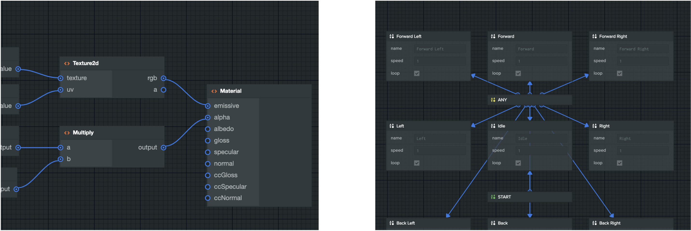

---
# Feel free to add content and custom Front Matter to this file.
# To modify the layout, see https://jekyllrb.com/docs/themes/#overriding-theme-defaults

layout: home
---

# PCUI-Graph - Node-based Graphs Made Easy

PCUI-Graph is an extension of PCUI. It provides an simple API for creating node-based graphs that can be easily integrated with any PCUI application.